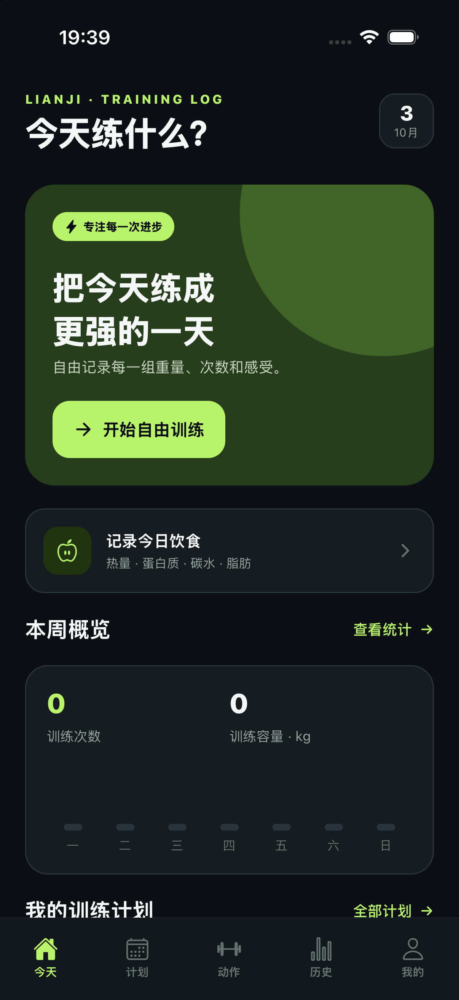

# 练迹 · iOS / Android / macOS / Apple Watch 训练记录应用

练迹是一个自由记录训练和饮食的工具，使用独立名称、界面和图标。iOS / Android 使用 Expo SDK 57、React Native 和 TypeScript；macOS / Apple Watch 使用 SwiftUI，共用原生端的训练数据模型。

## 下载预览版

[下载 Android APK · v1.1.0](https://github.com/allen7wang/lianji/releases/download/v1.1.0/Lianji-1.1.0-Android.apk)。在 Android 7.0+ 手机上下载后打开安装，按系统提示允许当前下载来源安装应用。安装后直接打开「练迹」，无需 Expo Go 或连接开发电脑。

[GitHub 发布页](https://github.com/allen7wang/lianji/releases/tag/v1.1.0)提供新版 Android、macOS 通用预览包，以及 iPhone / Apple Watch 模拟器预览包。macOS 包尚未签名或公证；Apple 模拟器包不能安装到真实手机或手表。

各平台的安装方式和验证范围见 [v1.1.0 发布说明](docs/release-v1.1.0.md)。这是公开预览版，尚未发布到 App Store 或 Google Play。



## 已实现

- 内置 51 个力量、间歇和地面练习动作，按部位搜索和筛选；支持自定义动作。
- 51 个内置动作均配有动图，iOS、Android、macOS 和 Apple Watch 均可从动作库或训练页面查看；支持暂停、继续、加载失败后重试。自定义动作暂不配演示素材。
- 保留推、拉、腿三个示例计划，提供 28 套模板、63 个训练日，涵盖经典分化、新手、力量、居家、HIIT、动物流、核心与活动度、运动专项力量；可预览动作与组数，一键添加整套计划，随后编辑组数、次数或秒数、重量和休息时间。
- 从计划或自由训练开始；逐组修改重量、次数或秒数、完成状态，添加动作和组数；支持按秒动作计时、自定义组间休息和训练笔记。
- 完成训练后保存历史，按本月或全部查看次数、完成组数、训练容量及近期趋势；可查看和删除单次训练。
- 记录体重、体脂率；记录每餐食物、份量、热量和三大营养素，查看最近 30 天每日摄入。
- SQLite 本地持久化，关闭应用后保留数据；无需注册即可离线使用。
- macOS 端支持训练计划、动作库、逐组训练、历史、饮食和身体数据记录。
- Apple Watch 端支持从计划或自由训练开始、记录重量、次数或秒数、完成组数、动作与组间休息倒计时及查看近期训练。

### 训练计划模板

手机进入「计划 → 计划模板」；Mac 进入「训练计划 → 计划模板」；Apple Watch 从首页进入「计划模板」。可按场景筛选，先查看器材、频率和每个训练日的动作、组数和次数，再添加到自己的计划中。

| 模板 | 场景 | 每轮训练日 | 水平 |
| --- | --- | --- | --- |
| 1分化 | 经典分化 | 1 | 新手 |
| 3分化 | 经典分化 | 3 | 有基础 |
| 5分化 | 经典分化 | 5 | 进阶 |
| 推拉腿 | 经典分化 | 3 | 有基础 |
| 新手全身 A/B | 新手入门 | 2 | 新手 |
| 上下肢 2分化 | 灵活安排 | 2 | 有基础 |
| 上下肢 4日 | 经典分化 | 4 | 有基础 |
| 推拉腿 6日 | 经典分化 | 6 | 进阶 |
| 居家哑铃全身 | 居家训练 | 2 | 新手 |
| 居家徒手 | 居家训练 | 2 | 新手 |
| 基础力量 5×5 | 力量提升 | 2 | 有基础 |
| 30分钟全身 | 灵活安排 | 2 | 新手 |
| HIIT 全身 | 间歇训练 | 2 | 有基础 |
| 低冲击间歇 | 间歇训练 | 1 | 新手 |
| 20/10 间歇 | 间歇训练 | 2 | 有基础 |
| 动物流基础 | 地面流动 | 2 | 新手 |
| 地面流动组合 | 地面流动 | 1 | 有基础 |
| 核心稳定 | 核心与活动度 | 2 | 新手 |
| 活动度与恢复 | 核心与活动度 | 1 | 新手 |
| 短跑专项力量 | 专项力量 | 2 | 有基础 |
| 半马专项力量 | 专项力量 | 2 | 有基础 |
| 全马专项力量 | 专项力量 | 2 | 有基础 |
| 游泳专项力量 | 专项力量 | 2 | 有基础 |
| 铁三专项力量 | 专项力量 | 2 | 有基础 |
| 自行车专项力量 | 专项力量 | 2 | 有基础 |
| 登山专项力量 | 专项力量 | 2 | 有基础 |
| 篮球专项力量 | 专项力量 | 2 | 有基础 |
| 羽毛球专项力量 | 专项力量 | 2 | 有基础 |

训练日按顺序轮换，可在训练日之间安排休息。模板的目标重量初始为 0 kg，添加后按实际修改。添加模板会保留已有计划；重复添加不会产生重复训练日，也不会覆盖编辑内容。删除其中一个训练日后，再添加同套模板可补齐缺少的训练日。

专项力量可再按短跑、半马、全马、游泳、铁三、自行车、登山、篮球和羽毛球筛选。模板提供配合专项训练的力量练习；跑量、游泳距离、骑行时间和比赛日程仍由用户安排。动物流模板是独立编写的基础地面练习，未采用官方课程编排。

按秒项目显示时长，计时结束后手动勾选完成；20/10 模板采用该间歇节奏，动作强度可自行调整。计时器目前只提供应用内倒计时，没有后台通知或自动判定完成。按秒组不计入力量训练容量（kg × 次）。旧训练记录保持原有次数语义，新模板使用明确的次/秒单位。

四端共用 `assets/plans/training-programs.json` 模板目录，各端仍使用各自的本地存储。

### 动作动图

手机端在动作库点击动作，或在训练页面点击「查看动图」；Mac 点击「查看动图」；Apple Watch 首页进入「动作动图」，或从正在训练的动作进入演示。

40 个动作使用在线人体模型 GIF，首次查看需要网络，加载后使用本地缓存（缓存可能被系统清理）。另外 11 项随应用打包，可离线查看：面拉真人 GIF、平板支撑呼吸提示 GIF，以及开合跳、兽式/蟹式/猿式支撑、蟹行、鸟狗式、猫牛式、侧平板和侧弓步的原创简图。静态支撑类演示保持姿势并提示呼吸。素材来源和授权记录见 [动作素材说明](assets/exercises/README.md)。

## 运行

需要 Node.js 22.13+。安装依赖：

```bash
npm install
```

`npm run ios` 或 `npm run android` 使用本机开发工具编译并安装独立的练迹应用。SDK 57 的最低系统版本可见 [Expo 官方说明](https://docs.expo.dev/versions/v57.0.0/)。

在 Mac 上查看 iPhone 模拟器预览，推荐使用：

```bash
npm run preview:ios
```

该命令把当前源文件复制到 `~/Library/Application Support/Lianji/SimulatorPreview/` 下的项目专用目录，按锁文件安装依赖，由 Expo 生成原生工程，然后编译 Release 版并安装到已启动的 iPhone 模拟器。JavaScript 和本地动图随应用打包，直接点击「练迹」即可打开，不需要 Expo Go 或保持预览服务运行。再次执行会同步最新代码并更新同一个应用，保留原有 SQLite 数据。可设置 `LIANJI_SIMULATOR_UDID` 指定目标模拟器。

手机端始终使用 `com.allenwang.lianji` 作为应用标识；升级已有安装时应保持此标识，避免产生第二个练迹图标。首次本地编译需要 Xcode 和 CocoaPods，并可能下载原生依赖。

`plugins/with-ios-constants.cjs` 通过 Expo 配置插件修复 SDK 57 的 Constants 构建脚本在带空格目录中的兼容问题；原生目录仍由 Expo 生成。

### macOS 与 Apple Watch

用 Xcode 打开 `apple/LianjiApple.xcodeproj`，选择 `LianjiMac` 或 `LianjiWatch` Scheme，并选择对应的 Mac 或 Apple Watch 模拟器运行。命令行也可用以下命令编译：

```bash
xcodebuild -project apple/LianjiApple.xcodeproj -scheme LianjiMac -sdk macosx CODE_SIGNING_ALLOWED=NO build
xcodebuild -project apple/LianjiApple.xcodeproj -scheme LianjiWatch -sdk watchsimulator -destination 'generic/platform=watchOS Simulator' CODE_SIGNING_ALLOWED=NO build
```

修改 `apple/project.yml` 的工程配置后，可在 `apple/` 目录运行 `xcodegen generate` 重新生成 Xcode 工程；日常修改 Swift 文件可以直接在 Xcode 工程中运行。

## 验证

```bash
npm run typecheck
npm run lint
npm run test:templates
npx expo export --platform ios
npx expo export --platform android
xcodebuild -project apple/LianjiApple.xcodeproj -scheme LianjiMac -sdk macosx CODE_SIGNING_ALLOWED=NO build
xcodebuild -project apple/LianjiApple.xcodeproj -scheme LianjiWatch -sdk watchsimulator -destination 'generic/platform=watchOS Simulator' CODE_SIGNING_ALLOWED=NO build
```

计划模板验证脚本使用隔离的内存 SQLite 数据库运行实际迁移和导入逻辑，检查 28 套模板及 51 项动图映射、旧数据库新增字段、旧计划和训练记录保留、重复导入、编辑后补齐、出错回滚、训练时长及休息设置复制。Apple 共享数据测试会在隔离文件中检查旧 JSON 升级、同名自定义动作和保存后重新读取，不会读写用户数据。

GitHub Actions 会在提交和 Pull Request 后检查代码规范、类型、计划导入逻辑及 iOS / Android 资源打包。

### Android APK 发布

「Android APK」工作流可选择已发布的源码标签，由 Expo 生成 Android 原生工程并编译包含 JavaScript 和本地素材的 Release APK。工作流产物使用临时构建签名，发布前需使用单独保管的固定发布密钥重新签名；私钥和口令不进入源码仓库或工作流。

下载工作流产物后，使用 `bash scripts/sign-android-apk.sh <构建产物.apk> <发布包.apk>` 完成签名与校验。需要配置 `ANDROID_HOME` 和可用的 Java；默认发布密钥保存在 Mac 的 `~/Library/Application Support/Lianji/Signing/Android/`，也可通过 `LIANJI_ANDROID_KEYSTORE`、`LIANJI_ANDROID_PASSWORD_FILE` 指定现有密钥和口令文件。脚本不会生成新密钥或覆盖已有发布包。

「Android APK smoke test」工作流会校验发布包的 SHA-256，然后在 Android 模拟器安装最终签名的 APK，检查首页、28 套计划入口和关闭后重新启动，再验证导入、重复导入、按秒计划保存、动作计时、休息计时、地面流动及 9 个专项筛选，并保存截图与运行日志。后续升级应保持 `com.allenwang.lianji` 和同一发布签名。

「Apple preview packages」工作流在相同源码上运行共享数据兼容测试，生成 Mac 通用包及 iPhone / Apple Watch 模拟器包。

`eas.json` 也提供生成 APK 的 `preview` 构建配置，使用 EAS 需要先登录 Expo 并配置相同的发布凭据。

## 许可

应用代码采用 [MIT](LICENSE) 许可。第三方动作素材采用各自的许可，其中面拉 GIF 为 CC BY-SA 4.0，详情见 [素材说明](assets/exercises/README.md)。

## 当前边界

这是可运行的本地版，没有账号、跨设备云同步、食品库与扫码识别、HealthKit 接入、付费会员或 AI 训练建议。当前在线动图采用原型演示素材，商用发布前需要确认素材授权或替换为已授权素材。发布到 App Store / Google Play 还需要开发者账号、签名、隐私材料及真机验收，并确认现有应用标识归属开发者账号。已有安装的升级应保持同一应用标识。

iOS / Android 数据保存在各自设备的 SQLite 数据库中；macOS / Apple Watch 数据保存在各自应用的本地 JSON 文件中。当前各端数据独立，卸载应用可能丢失数据。正式投入使用前，应加入备份与恢复或云同步。
